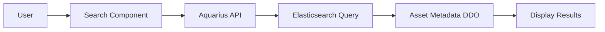
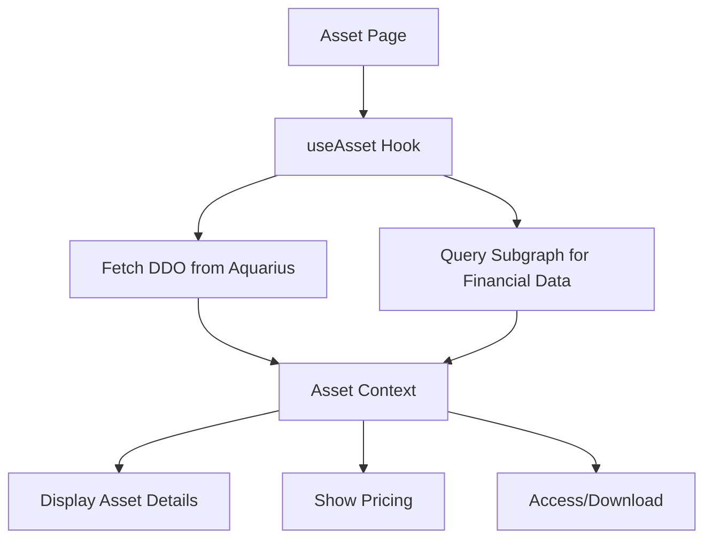
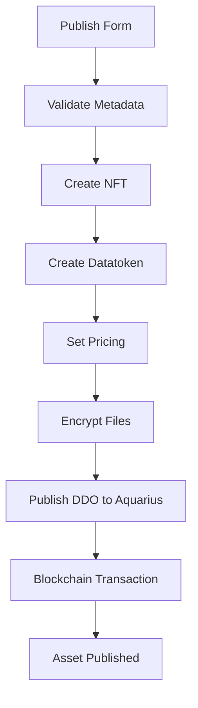
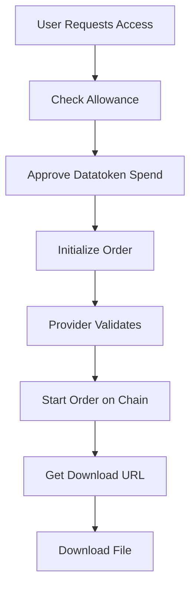

## Technology Stack

The AgrospAI Portal is built with modern web technologies:

### Core Framework

- **Next.js 13.3.4** - React framework with SSR and static generation
- **React 18.2.0** - UI library
- **TypeScript 5.2.2** - Type-safe JavaScript

### Blockchain Integration

- **Ocean Protocol (@oceanprotocol/lib 3.1.3)** - Decentralized data exchange
- **Ethers.js 5.7.2** - Ethereum library
- **Wagmi 0.12.12** - React hooks for Ethereum
- **ConnectKit 1.3.0** - Wallet connection UI

### Data & State Management

- **Urql 3.0.3** - GraphQL client for Ocean Protocol Subgraph
- **@tanstack/react-query 4.42.0** - Async state management
- **Formik 2.4.2** - Form management
- **Yup 0.32.11** - Schema validation

### UI Components

- **CSS Modules** - Component-scoped styling
- **@oceanprotocol/art** - Ocean Protocol design system
- **React Data Table Component** - Data tables
- **React Modal** - Modal dialogs
- **React Toastify** - Notifications

### Development Tools

- **Jest 29.6.2** - Testing framework
- **Testing Library** - Component testing
- **Storybook 6.5** - Component development
- **ESLint** - Code linting
- **Prettier** - Code formatting

## Project Structure

```
├── .github/workflows/       # CI/CD pipelines
├── .jest/                   # Jest test configuration
├── .storybook/             # Storybook configuration
├── content/                # Static content (privacy policies, etc.)
├── public/                 # Static assets
├── scripts/                # Build and utility scripts
└── src/                    # Source code
    ├── @constants/         # Application constants
    ├── @context/           # React context providers
    ├── @hooks/             # Custom React hooks
    ├── @images/            # Image assets
    ├── @types/             # TypeScript type definitions
    ├── @utils/             # Utility functions
    ├── components/         # React components
    ├── pages/              # Next.js pages (routing)
    ├── server/             # Server-side code
    └── stylesGlobal/       # Global styles
```

## Core Directories

### src/components/

Component organization follows atomic design principles:

```
components/
├── @shared/               # Reusable shared components
│   ├── atoms/             # Basic UI elements (buttons, inputs)
│   ├── molecules/         # Component combinations
│   └── organisms/         # Complex component structures
├── App/                   # App wrapper and providers
├── Asset/                 # Asset detail pages
├── Header/                # Site header and navigation
├── Footer/                # Site footer
├── Home/                  # Homepage components
├── Profile/               # User profile components
├── Publish/               # Asset publishing flow
├── Search/                # Search functionality
└── VerifiablePresentation/ # Gaia-X compliance components
```

Each component typically includes:
- `index.tsx` - Component implementation
- `index.module.css` - Scoped styles
- `index.stories.tsx` - Storybook stories
- `index.test.tsx` - Unit tests

### src/@utils/

Utility functions organized by domain:

```
@utils/
├── aquarius/              # Metadata cache queries
├── compute.ts             # Compute-to-data utilities
├── ddo.ts                 # DDO (data descriptor object) helpers
├── nft.ts                 # NFT operations
├── ocean/                 # Ocean Protocol integration
├── provider.ts            # Provider service integration
├── subgraph.ts            # Subgraph queries
├── wallet/                # Wallet operations
└── verifiablePresentations/ # Gaia-X VP handling
```

Key utilities:
- **aquarius/** (`src/@utils/aquarius/`) - Direct Aquarius API calls for metadata
- **provider.ts** (`src/@utils/provider.ts:1-250`) - Provider service integration (encryption, downloads)
- **subgraph.ts** (`src/@utils/subgraph.ts:1-180`) - GraphQL queries to Ocean Protocol Subgraph
- **compute.ts** (`src/@utils/compute.ts:1-400`) - Compute-to-data job management

### src/@context/

React Context providers for global state:

```
@context/
├── Asset.tsx              # Asset detail state
├── Automation/            # Automation workflows
├── CookieConsent.tsx      # GDPR cookie consent
├── MarketMetadata/        # App configuration
├── Profile/               # User profile data
├── UrqlProvider.tsx       # GraphQL client setup
├── UserPreferences.tsx    # User settings
└── VerifiablePresentation.tsx # VP context
```

**Key Contexts:**

- **MarketMetadata** - App configuration from `app.config.js`
- **Asset** - Current asset state (DDO, pricing, access)
- **UserPreferences** - Chain selection, bookmarks, settings
- **UrqlProvider** - GraphQL client for subgraph queries

### src/@hooks/

Custom React hooks for common operations:

```
@hooks/
├── useAccountPurgatory/   # Check account purgatory status
├── useAsset/              # Asset operations
├── useBalance/            # Token balances
├── useConsent/            # Cookie consent state
├── useMarketMetadata/     # App configuration
├── useNetworkMetadata/    # Chain metadata
├── useProfile/            # ENS profile data
└── usePricing/            # Asset pricing
```

### src/pages/

Next.js file-based routing:

```
pages/
├── _app.tsx               # App wrapper
├── _document.tsx          # HTML document structure
├── index.tsx              # Homepage
├── asset/
│   └── [did].tsx          # Asset detail page
├── profile/
│   └── [accountId].tsx    # User profile page
├── publish/
│   ├── index.tsx          # Publish home
│   └── [type].tsx         # Publish form by type
└── search/
    └── index.tsx          # Search page
```

## Data Flow Architecture

### 1. Asset Discovery Flow



**Implementation:**
- Search UI in `src/components/Search/`
- Aquarius queries in `src/@utils/aquarius/`
- Results displayed with `src/components/@shared/AssetList/`

### 2. Asset Detail Flow



**Implementation:**
- Page: `src/pages/asset/[did].tsx`
- Context: `src/@context/Asset.tsx`
- Hook: `src/@hooks/useAsset/`

### 3. Asset Publishing Flow



**Implementation:**
- UI: `src/components/Publish/`
- NFT creation: `src/@utils/nft.ts`
- Encryption: `src/@utils/provider.ts`
- Form validation: Formik + Yup schemas

### 4. Data Access Flow



**Implementation:**
- Order initialization: `src/@utils/order.ts`
- Provider integration: `src/@utils/provider.ts`
- Download handling: Asset detail component

## Configuration Files

### app.config.js

Main application configuration (`app.config.js:1-136`):

```javascript
module.exports = {
  metadataCacheUri: 'https://aquarius.pontus-x.eu',
  chainIds: [1, 137, 32456], // Default chains
  chainIdsSupported: [...], // All supported chains
  marketFeeAddress: '0x...',
  publisherMarketOrderFee: '0',
  allowFixedPricing: 'true',
  allowFreePricing: 'true',
  // ... more config
}
```

### chains.config.js

Blockchain network configuration:

```javascript
// Defines supported EVM chains
// RPC endpoints, block explorers, etc.
```

### address.config.js

Contract addresses for each network:

```javascript
// Ocean Protocol contract addresses
// NFT Factory, Fixed Rate Exchange, Dispenser, etc.
```

## Key Design Patterns

### 1. Context + Hooks Pattern

Global state managed with Context API:

```typescript
// Context definition
const AssetContext = createContext<AssetContextValue>()

// Provider component
export function AssetProvider({ children }) {
  const [ddo, setDdo] = useState<Asset>()
  // ... state and logic
  return (
    <AssetContext.Provider value={{ ddo, ... }}>
      {children}
    </AssetContext.Provider>
  )
}

// Custom hook for consumption
export function useAsset() {
  return useContext(AssetContext)
}
```

### 2. Component Co-location

Each component keeps related files together:

```
Button/
├── index.tsx          # Component logic
├── index.module.css   # Styles
├── index.stories.tsx  # Storybook stories
└── index.test.tsx     # Tests
```

### 3. Utility-First Approach

Business logic extracted to utilities:

```typescript
// Component remains thin
function Component() {
  const result = await utilityFunction()
  return <div>{result}</div>
}

// Logic in @utils/
export async function utilityFunction() {
  // Complex business logic here
}
```

### 4. Type Safety with TypeScript

Strong typing throughout:

```typescript
// Type definitions in @types/
interface Asset {
  id: string
  metadata: Metadata
  services: Service[]
}

// Used in components
function AssetDetail({ asset }: { asset: Asset }) {
  // TypeScript ensures correct usage
}
```

## Integration Points

### Ocean Protocol

**Smart Contracts:**
- NFT Factory (ERC721)
- Datatoken Factory (ERC20)
- Fixed Rate Exchange
- Dispenser

**Services:**
- Aquarius (metadata cache)
- Provider (data service)
- Subgraph (blockchain indexing)

### Gaia-X Integration

**Verifiable Presentations:**
- Compliance credential verification
- Self-description validation
- Registry integration

Implementation in `src/@utils/verifiablePresentations/` and `src/components/VerifiablePresentation/`

### AgroPortal Integration

Agriculture ontology integration for semantic metadata enrichment.

Configuration: `AGROPORTAL_API_KEY` in `.env`

## Performance Optimizations

### 1. Code Splitting

Next.js automatic code splitting per page:

```typescript
import dynamic from 'next/dynamic'

const HeavyComponent = dynamic(() => import('./Heavy'), {
  loading: () => <p>Loading...</p>
})
```

### 2. Image Optimization

Next.js Image component with automatic optimization:

```typescript
import Image from 'next/image'

<Image
  src="/logo.png"
  width={500}
  height={500}
  alt="Logo"
/>
```

### 3. Static Generation

Static page generation where possible for better performance.

### 4. Request Caching

Urql GraphQL client with cache:

```typescript
const client = createClient({
  url: subgraphUri,
  exchanges: [cacheExchange, fetchExchange]
})
```

## Security Considerations

### 1. Environment Variables

Sensitive data in environment variables, never committed:

```bash
# .env (gitignored)
NEXT_PUBLIC_INFURA_PROJECT_ID=secret
```

### 2. Input Validation

All user inputs validated with Yup schemas:

```typescript
const schema = yup.object().shape({
  name: yup.string().required(),
  url: yup.string().url().required()
})
```

### 3. Content Security Policy

Security headers configured in `netlify.toml:1-12`.

### 4. Wallet Signature Verification

User actions requiring signatures verified on-chain.

## Next Steps

- [Local Setup](/development/local-setup) - Set up your development environment
- [Testing Guide](/development/testing) - Learn testing practices
- [Deployment](/development/deployment) - Deploy the application
