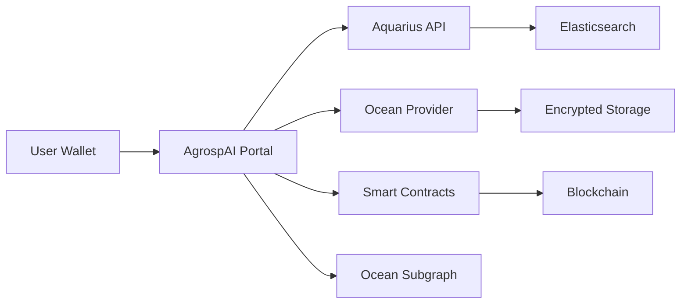

# Welcome to AgrospAI Portal

AgrospAI Portal is a decentralized data marketplace designed specifically for the agricultural research community. Built on Ocean Protocol and integrated with the Gaia-X Web3 ecosystem (Pontus-X), it enables researchers to securely publish, discover, and access agricultural datasets and AI algorithms while maintaining control over their intellectual property.

## What is AgrospAI Portal?

AgrospAI Portal is a React-based web application that serves as a gateway to the decentralized data economy for agricultural research. It provides:

- **Decentralized Data Publishing**: Publish datasets and algorithms as NFTs with configurable access controls
- **Secure Asset Discovery**: Browse and search through agricultural research assets using Elasticsearch-powered queries
- **Web3 Integration**: Connect your Ethereum-compatible wallet to interact with the marketplace
- **Flexible Pricing**: Support for fixed pricing and free distribution models
- **Verifiable Credentials**: Integration with Gaia-X for trusted data exchange
- **Ocean Protocol Foundation**: Built on Ocean Protocol's robust data sharing infrastructure

## Key Capabilities

<CardGroup cols={2}>
  <Card title="Publish Data Assets" icon="upload">
    Create NFTs representing your datasets or algorithms with customizable metadata, pricing, and access controls. Each asset is minted as an ERC-721 token with associated datatokens for access management.
  </Card>

  <Card title="Discover & Access" icon="magnifying-glass">
    Search through available datasets and algorithms using powerful filters. Access assets by acquiring datatokens through fixed-rate exchanges or free dispensers.
  </Card>

  <Card title="Compute-to-Data" icon="server">
    Run algorithms on datasets without exposing raw data. Execute computations in secure environments while preserving data privacy and ownership.
  </Card>

  <Card title="Gaia-X Compliance" icon="shield-check">
    Integrated with Gaia-X ecosystem for compliance checking and verifiable credentials, ensuring trustworthy data exchange within European data spaces.
  </Card>
</CardGroup>

## Use Cases

### For Data Providers

- **Monetize Research Data**: Publish agricultural datasets with fixed pricing or make them freely available
- **Maintain Control**: Keep ownership of your data while enabling access through datatokens
- **Build Reputation**: Establish your presence in the decentralized research community
- **Track Usage**: Monitor sales and access patterns through Ocean Protocol subgraph

### For Data Consumers

- **Access Quality Data**: Discover curated agricultural research datasets and AI models
- **Verifiable Provenance**: All assets include metadata about publishers and data lineage
- **Privacy-Preserving Compute**: Run analyses without downloading sensitive data
- **Interoperable**: Standard Ocean Protocol DDO (DID Document) format ensures compatibility

### For Algorithm Developers

- **Publish AI Models**: Share machine learning algorithms for agricultural applications
- **Monetize Innovation**: Set pricing for algorithm execution
- **Compute-to-Data**: Run your algorithms on private datasets without data exposure

## Architecture Overview

### Technology Stack

<Steps>
  <Step title="Frontend Layer">
    - **Next.js 13**: React framework for server-side rendering and static generation
    - **TypeScript**: Type-safe development
    - **Wagmi**: React hooks for Ethereum wallet integration
    - **Urql**: GraphQL client for Ocean Protocol subgraph queries
  </Step>

  <Step title="Ocean Protocol Layer">
    - **Aquarius**: Metadata cache running Elasticsearch for asset discovery
    - **Provider**: Handles file encryption, decryption, and compute job orchestration
    - **Subgraph**: The Graph indexer for on-chain financial data
    - **Smart Contracts**: NFT Factory, Datatokens, Fixed Rate Exchange, Dispenser
  </Step>

  <Step title="Blockchain Layer">
    - **ERC-721 (NFT)**: Represents ownership of the published asset
    - **ERC-20 (Datatoken)**: Represents access rights to the asset
    - **Ethereum-compatible chains**: Supports Pontus-X and other configured networks
  </Step>

  <Step title="External Services">
    - **Gaia-X Registry**: Compliance verification
    - **AgroPortal**: Agricultural ontology integration
    - **ENS**: Ethereum Name Service for publisher profiles
  </Step>
</Steps>

### Data Flow

1. **Publishing**: Users create assets through the portal, which mints NFTs and datatokens via smart contracts, then stores encrypted metadata in Aquarius
2. **Discovery**: Portal queries Aquarius (Elasticsearch) and Ocean Subgraph (The Graph) to display available assets
3. **Access**: Users purchase datatokens through fixed-rate exchanges, then use them to download files or execute compute jobs via Provider

## Key Features

### Smart Contract Integration

- **NFT Factory**: Creates ERC-721 tokens representing data assets
- **Datatoken Templates**: Three template options for different access control patterns
- **Fixed Rate Exchange**: Automated market maker for datatoken pricing
- **Dispenser**: Free distribution of datatokens for open access assets

### Metadata Management

- **DDO Schema**: Ocean Protocol's Decentralized Data Object format
- **Rich Metadata**: Support for descriptions, tags, categories, licenses
- **File Validation**: Checksums and file size verification
- **Provenance Tracking**: Publisher information and creation timestamps

### User Experience

- **Responsive Design**: Works on desktop, tablet, and mobile devices
- **Dark Mode**: Theme switching for user preference
- **Multi-Language**: Extensible internationalization support
- **GDPR Compliant**: Privacy preference center and consent management

## Getting Started

Ready to start using AgrospAI Portal? Here's what to do next:

<CardGroup cols={2}>
  <Card title="Quickstart" icon="rocket" href="/quickstart">
    Get up and running with AgrospAI Portal in minutes. Connect your wallet and browse or publish your first asset.
  </Card>

  <Card title="Installation" icon="download" href="/installation">
    Set up a local development environment to customize or contribute to the AgrospAI Portal.
  </Card>

  <Card title="Publishing Guide" icon="book" href="/publishing">
    Learn how to publish datasets and algorithms with proper metadata and pricing strategies.
  </Card>

  <Card title="API Reference" icon="code" href="/api-reference">
    Explore the Ocean Protocol APIs and smart contract interfaces used by the portal.
  </Card>
</CardGroup>

## Community & Support

AgrospAI Portal is built on open-source technologies and welcomes contributions from the community.

- **GitHub Repository**: [deltaDAO/mvg-portal](https://github.com/deltaDAO/mvg-portal)
- **Ocean Protocol Docs**: [docs.oceanprotocol.com](https://docs.oceanprotocol.com)
- **Pontus-X Network**: [pontus-x.eu](https://pontus-x.eu)

<Note>
AgrospAI Portal is based on Ocean Market, an open-source marketplace template. It's customized for agricultural research needs while maintaining compatibility with the Ocean Protocol ecosystem.
</Note>
